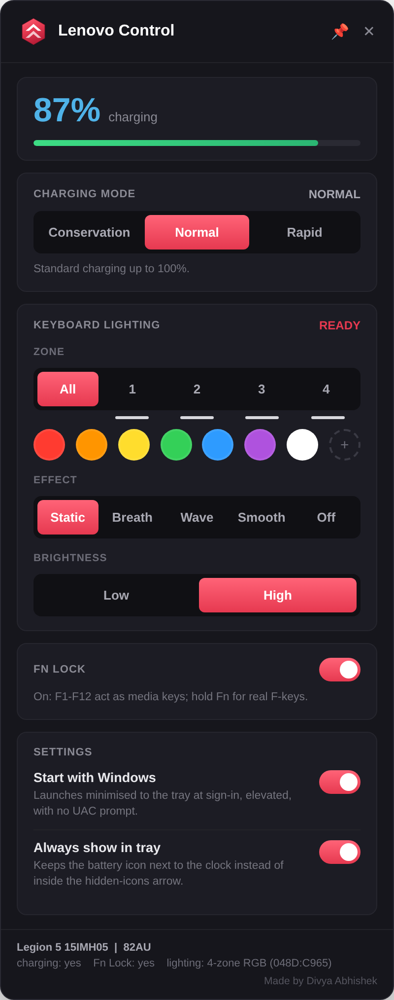
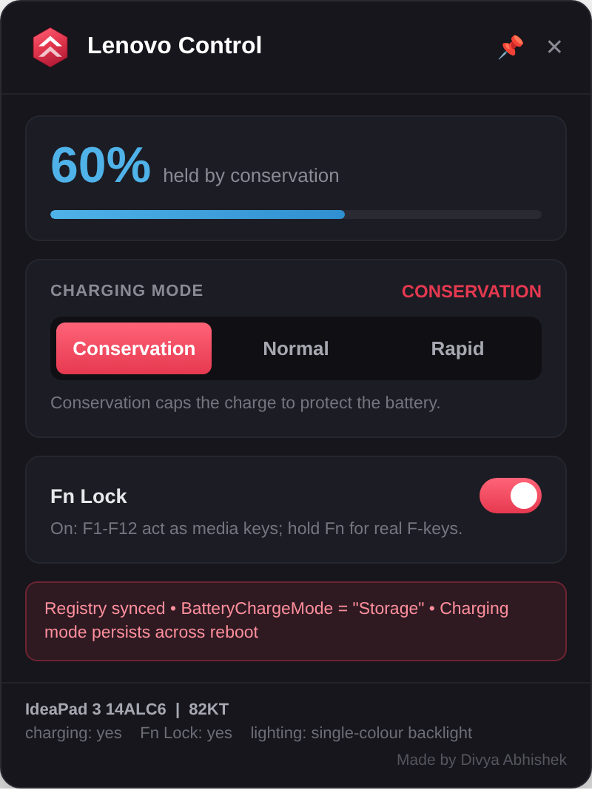
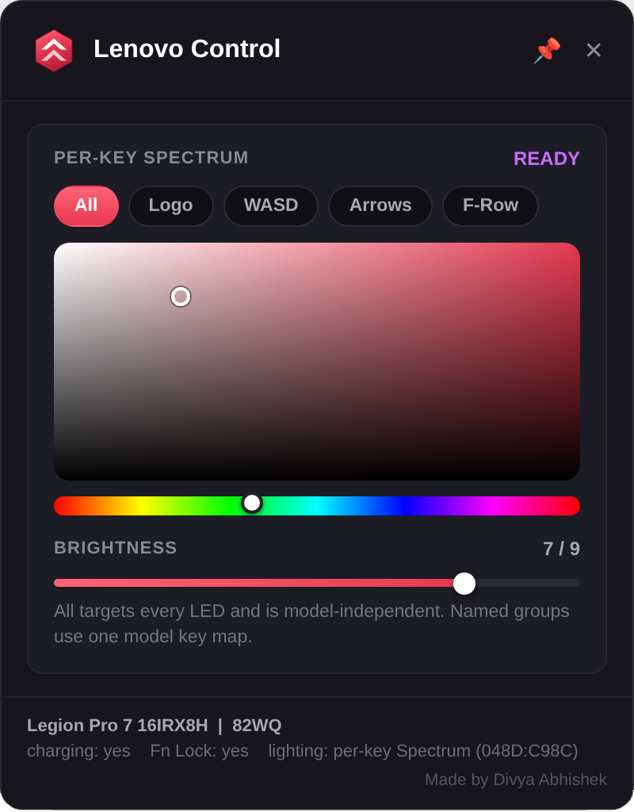

# Lenovo Control

A lightweight, always-on-top widget for Lenovo Legion, IdeaPad, and LOQ laptops — charging mode, keyboard lighting, and Fn Lock, with a live battery gauge in the system tray.

It talks to the hardware directly. **No Lenovo Vantage, no Legion Toolkit, no background service required.** Settings persist across reboots.

<p align="center">
  
  &nbsp;&nbsp;
  
</p>

---

## Why this exists

Lenovo Vantage does three useful things — charging mode, keyboard lighting, Fn Lock — wrapped in an Electron app with a background service, telemetry, and a UWP dependency chain that occasionally breaks itself on a Windows update. This widget talks to the same driver Vantage does and skips everything else. One PowerShell file, no service, no install.

---

## Features

- **Charging mode** — Conservation / Normal / Rapid Charge, applied straight to the Energy Driver
- **Keyboard lighting** — single-colour backlight, 4-zone RGB, or per-key Spectrum, whichever your laptop actually has
- **Fn Lock** — toggle media keys vs. function keys, with automatic detection of your model's bit layout
- **Live battery in the tray** — colour-coded by state, updates instantly on plug/unplug rather than waiting for the next poll
- **Settings persist** — charging mode and lighting are saved and restored across reboots, and written to the registry so Lenovo's own background services don't fight the widget for control
- **Starts elevated at login** — no UAC prompt every boot
- **No model list** — the widget probes your hardware at startup and shows only what answers back

---

## Screenshots

<table>
<tr>
<td align="center"><br><sub>Per-key Spectrum with the colour and hue picker</sub></td>
<td align="center"><br><sub>Tray icon colour by charging state</sub></td>
</tr>
</table>

---

## Setup

Grab the latest release, or clone the repo. Everything needs to live in one folder.

**Option A — run the prebuilt `.exe` (fastest)**

Download `Lenovo_Control.exe` from [Releases](../../releases) and run it. It elevates itself.

**Option B — build the `.exe` yourself**

1. Run `Build_Lenovo_Control_Exe.bat` once — it installs `ps2exe` from the PowerShell Gallery and compiles the widget.
2. Run the resulting `Lenovo_Control.exe`.
3. Optional: right-click it → Pin to taskbar.

**Option C — run the script directly, no compiling**

Double-click `Lenovo_Control.bat`.

Administrator is required either way — the Lenovo Energy Driver can't be opened without it, so charging mode and Fn Lock would silently do nothing.

---

## Using it

- The battery percentage sits in the **system tray**, next to the clock.
- **Click the tray icon** to open or close the panel.
- **Right-click the tray icon** for Show / Exit.
- Drag the panel by its title bar. The pin keeps it above other windows.
- Closing with `X` hides to the tray; Exit on the tray menu quits properly.

**Settings (inside the panel):**

- **Start with Windows** — creates an elevated logon task, so there's no UAC prompt every boot. Starts minimised to the tray.
- **Always show in tray** — asks Windows to keep the icon beside the clock rather than inside the hidden-icons arrow.

---

## What adapts to your laptop

Nothing is hard-coded to a model list. At startup the widget *asks the hardware* what it supports and shows only what answers:

| Feature | How it is detected |
|---|---|
| Charging mode | Energy driver responds to the battery IOCTL (`0x831020F8`) |
| Fn Lock | Energy driver responds to the settings IOCTL (`0x831020E8`) |
| Keyboard lighting | HID feature-report **length** decides the type |

Keyboard type comes from the report length rather than the USB product ID, because Lenovo has shipped many IDs but the length has stayed constant:

- **33 bytes** → 4-zone RGB (zone selector, effects, brightness)
- **960 bytes** → per-key Spectrum (target groups, effects, brightness)
- neither, but the energy driver answers → single-colour backlight (Off / Low / High)
- nothing answers → the card explains itself, and lists every Lenovo USB device seen

**Rapid Charge** isn't on every model, and there's no documented capability bit to read up front — the widget finds out the first time you use it. If the mode refuses to take, the button disables itself and the finding is remembered.

---

## Settings that persist across reboots

Charging mode, lighting effects, colours, and brightness are saved to:

```
%APPDATA%\LenovoControl\preferences.json
```

and restored automatically on the next launch.

Charging mode is also written to the registry key Lenovo's own background service reads:

```
HKCU\Software\Lenovo\VantageService\AddinData\IdeaNotebookAddin
```

This matters more than it sounds like it should — see the next section.

---

## The `LenovoSmartService` gotcha

If you've ever set Conservation mode, closed the app, and come back to find it quietly charging to 100% anyway, this is why:

`LenovoSmartService` — a background service some Lenovo laptops ship with even without Vantage installed — reads that same registry key on its own schedule and reapplies whatever mode it finds there. If the key has never been set, it defaults to **Rapid Charge**. So a widget (or Vantage itself) can set the hardware to Conservation, and a few minutes later the service quietly puts it back to Rapid, with no UI anywhere telling you it happened.

Credit for tracking this down goes to **[u/chaugh1](https://www.reddit.com/user/chaugh1/)** on Reddit, who noticed starting `LenovoSmartService` was the trigger and traced it to this registry value:

| Registry value | Mode |
|---|---|
| `Storage` | Conservation |
| `Normal` | Normal |
| `Quick` | Rapid Charge |

The widget now writes this value **before** issuing the hardware IOCTL, initializes it to `Storage` on first run if it's empty (so the service's default can't silently pick Rapid for you), and shows a warning banner in the panel if it detects `LenovoSmartService`, `LenovoVantageService`, or `lvcomserv` running.

If you still see it drift back to Rapid Charge after that, the cleanest fix is disabling the service outright:

```
services.msc → LenovoSmartService → Properties → Startup type: Disabled
```

(Note: this may also stop Legion Space from launching, if you have that installed — it's a shared dependency.)

---

## Colours in the tray icon

| Colour | Meaning |
|---|---|
| Green | Charging |
| Blue | Plugged in but not charging (usually Conservation holding it) |
| Crimson | On battery |
| Amber | 30% or below |
| Red | 15% or below |

---

## If something doesn't work

The widget is built to tell you when it fails rather than pretend it worked.

- **Lighting says "no keyboard"** — the panel lists every Lenovo USB interface it found, with its report length. That's enough to widen the match — open an issue with that line.
- **Fn Lock says the model ignored it** — it reports the raw driver value. The first toggle also measures which bit actually changed and adapts to it.
- **A charging mode doesn't stick** — see [the `LenovoSmartService` section](#the-lenovosmartservice-gotcha) above.
- **Lighting write rejected** — Vantage holds exclusive control of the keyboard. Close it and try again.
- **Settings reset after reboot** — check that `%APPDATA%\LenovoControl\preferences.json` exists and isn't empty; delete it to reset to defaults if it looks corrupted.
- **"Startup Error: root Visual... cannot have a parent"** — a WPF re-initialization issue that can follow sleep/wake or a service conflict. Fixed as of v2.2; update if you're on an older build.

---

## Not supported

- **ThinkPad** — different embedded-controller architecture, out of scope for this widget.
- **Charging while powered off** — that requires a 24/7 background service (which is exactly what Vantage's service does, and what this project deliberately avoids). Use a BIOS charge-limit setting if you need this.

---

## Files

| File | What it is |
|---|---|
| `Lenovo_Control.ps1` | The widget itself. Everything lives in this one file. |
| `Lenovo_Control.bat` | Launcher — elevates, then starts the widget. Use this if you don't build the `.exe`. |
| `Build_Lenovo_Control_Exe.bat` | One-time: compiles the `.ps1` into `Lenovo_Control.exe`. |
| `Startup_Setup.bat` | Optional: enable/disable "start at logon" from outside the app. |
| `Lenovo_Control_Icon.ico` | App icon, embedded into the `.exe` by the build script. |
| `Lenovo_Control.exe` | Prebuilt `.exe` — download this if you just want to run it. |

---

## Credits

Hardware protocols were taken from open-source projects that reverse-engineered them, not guessed:

- [LenovoLegionToolkit](https://github.com/BartoszCichecki/LenovoLegionToolkit) — battery mode, Fn Lock, RGB keyboard
- [4JX/L5P-Keyboard-RGB](https://github.com/4JX/L5P-Keyboard-RGB) — 4-zone 33-byte report layout
- [Triangle-GitHub/LegionLaptopToolkitCLI](https://github.com/Triangle-GitHub/LegionLaptopToolkitCLI) — single-colour backlight, energy driver IOCTLs
- [alstergee/legion-spectrum-control](https://github.com/alstergee/legion-spectrum-control) — Spectrum per-key protocol
- [u/chaugh1](https://www.reddit.com/user/chaugh1/) — found and diagnosed the `LenovoSmartService` registry override that was silently reverting Conservation mode

Made by **Divya Abhishek**.
